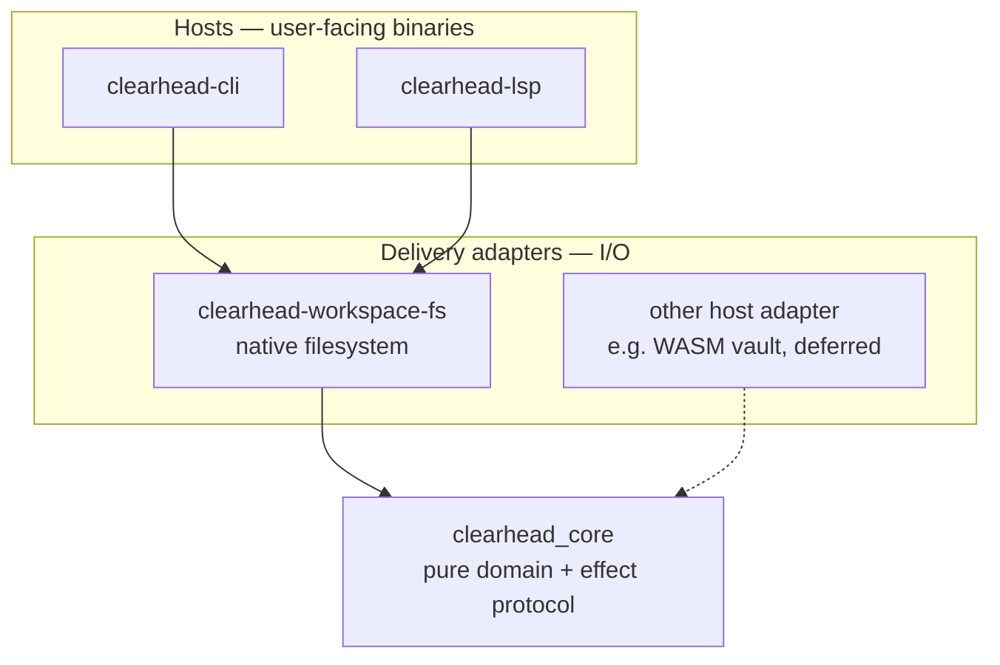
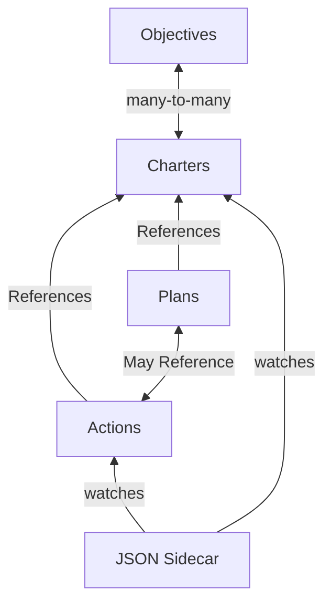

# Architecture Overview

The organising principle of this codebase is a single seam: **a pure domain
core that decides, and host adapters that deliver.** Core holds the model and
the algorithms and performs no I/O; the machinery that touches a filesystem,
a network, or an editor buffer lives outside it. Everything below follows from
that split.

## The layers



- **`clearhead_core`** — the pure domain library. It owns the in-memory model
  (`DomainModel` and its parts), the pure algorithms (parse, format, diff,
  filter, expand, reference resolution, RDF projection), and — crucially — the
  *decision* of what a mutation should change. It never opens a file. It is
  built for native targets and for `wasm32`, because it assumes no operating
  system. `.actions` parsing/formatting and the RDF publication live here.
- **Delivery adapters** — the code that assumes a host. The native one,
  [`clearhead-workspace-fs`](../crates/clearhead-workspace-fs), turns Core's
  logical decisions into real filesystem reads and durable writes (locking,
  journaling, `fsync`, atomic rename, recover-forward). A non-filesystem host
  (a browser talking to a vault API) would supply its own adapter implementing
  the same boundary, and Core would not change.
- **Hosts** — the user-facing binaries. `clearhead-cli` is the synchronous
  terminal client; `clearhead-lsp` is the standalone editor server. Each
  composes Core (decisions) with `clearhead-workspace-fs` (delivery). The CLI
  being "thin" is a *consequence* of this seam, not a goal pursued on its own.

This reverses an earlier arrangement in which Core owned configuration and
filesystem persistence directly. Pushing I/O out to adapters is what makes the
same decision logic runnable in a browser and keeps Core testable without a
disk.

## Conceptual Model

The **Rust struct (IR) is the canonical representation.** Everything else is a
view of it or a persistence mechanism for it.

- The **workspace** is all the plaintext files users edit directly. These files
  are the durable source of truth; a delivery adapter reads them and Core parses
  them into the IR.
- Analytics and query tools (for example the CLI's in-process SPARQL layer) read
  the same workspace files like any other consumer. The layout and configuration
  language they rely on is shared — defined once by Core's host-neutral contracts
  and implemented by the adapter — so every tool speaks the same dialect.

## The delivery boundary

Core and an adapter communicate through host-neutral types in
`clearhead_core::workspace::resource`. No OS paths, no `io::Error`, no byte
reads cross into Core:

- **`WorkspacePath` / `ResourceLocation`** — logical, `/`-separated paths with
  no symlink, permission, or root-directory meaning. The adapter maps them to
  physical paths.
- **`ResourceSnapshot`** — immutable bytes the *adapter* has already read. Core
  consumes snapshots; it never performs the read.
- **`ResourceRevision`** — opaque per-resource evidence Core compares but never
  interprets (natively, a content digest).
- **`Effect`** (`Write` / `Remove` / `Move`) bundled into an **`EffectBatch`**,
  each affected resource carrying a precondition (`Missing` or a `Revision`).
  Core emits the batch; the adapter validates preconditions and executes it.
- **`PreparedMutation`** — speculative next state adopted **only** after the
  adapter confirms successful delivery. On conflict or failure the speculative
  state is thrown away and the caller reloads.

The full round trip is: **inventory → read bytes into snapshots → Core prepares
an `EffectBatch` → adapter checks preconditions → adapter executes durably →
adopt outcome.**

## Workspace Architecture

Per the [Process Specification][Process Specification], hosts leverage our
[Naming Conventions][Naming Conventions] to discover files and build the domain
model.



### File Format Distinctions

It matters how each domain model maps to files in the workspace:

- `Objectives` → `.md` files in the `objectives/` directory, following the
  [Objectives File Specification][Objectives File Specification]
- `Charters` → `.md` files in the workspace root or any subdirectory, following
  the [Charter File Specification][Charter File Specification]
- `Plans` → `.ics` files conforming to the VTODO standard
- `Planned Acts` → `.actions` files conforming to the action file specification
- `Sidecar` → a JSON data sidecar capturing data that does not yet belong in the
  Actions DSL, scoped to one sidecar per charter

These formats come together to form and update the `DomainModel` in memory,
which is the heart of the architecture — from the CLI to the LSP server to UI
rendering, everything relies on these formats being well defined and adhered to.

#### File Conversions

Converting between file formats is a core capability. We deliver functionality
by making the same structures available in different representations:

- Plan DSL (`.actions` files)
- Markdown (Objectives and Charters)
- VTODO (recurring Plans and standalone Action projections)
- JSON (sidecars)

#### Calendar Export Boundary

When plans are exported as `.ics` files, the CLI writes them to:

```text
$XDG_DATA_HOME/clearhead/plans/<charter-slug>/<plan-uid>.ics
```

This is an **output boundary** — the CLI's responsibility ends at writing a
valid iCalendar file to that path. Sync to external calendar systems (Google
Calendar, CalDAV servers, etc.) is handled entirely by external tooling (e.g.,
vdirsyncer). The CLI has no dependency on any sync tool and makes no assumptions
about what, if anything, consumes these files.

This is intentional. Keeping sync out of the CLI means:

- the CLI remains testable without network or credentials
- operators choose their own sync strategy
- the `.ics` files are usable standalone by any CalDAV-aware tool

Project-local workspaces (those with a `.clearhead/` directory at the project
root) write plans to `.clearhead/plans/` within that project. These are
development workspace files and are not expected to be in the personal calendar
sync path.

## Reference

[Process Specification]: https://github.com/ClearHeadToDo-Devs/specifications/blob/master/process.md
[Naming Conventions]: https://github.com/ClearHeadToDo-Devs/specifications/blob/master/naming_conventions.md
[Charter File Specification]: https://github.com/ClearHeadToDo-Devs/specifications/blob/master/charters.md
[Objectives File Specification]: https://github.com/ClearHeadToDo-Devs/specifications/blob/master/objectives.md
